# Wrenwired - Choose-Your-Own-Adventure Game

This project is a point-and-click choose-your-own-adventure style game about a character who wakes up with no memories and has to figure out what happened to them. It uses JavaScript to create an interactive game experience by responding to the user's actions and changing elements on the page accordingly. The live site has been deployed to GitHub Pages.

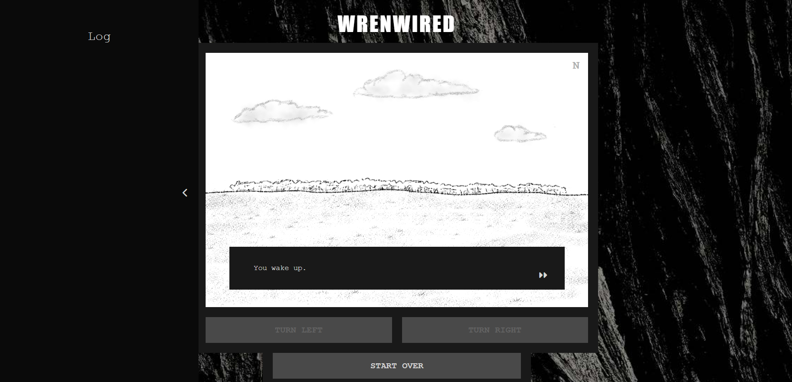

View the live project [here](https://mlgranger540.github.io/wrenwired/).

---

## UX

### Goals

- Goals for new visitors

    - Play the game and explore the story

    - Get expected functionality from buttons and features

    - Get feedback for actions

    - Interactivity and personalisation in the game e.g. elements respond to mouse actions, name is stored and used during gameplay

    - Have fun!

- Goals for return visitors

    - Replay the game

    - Try different options/paths to explore different story endings

- Goals for site creator

    - Create a fun and entertaining game experience for others to enjoy

    - Write and share the story of the game

---

## Design

The initial design of the project was mapped out with a wireframe using [Justinmind](https://www.justinmind.com/).

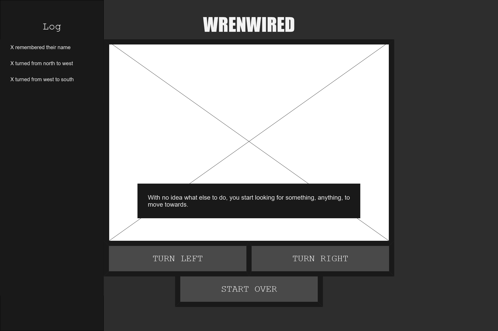

I used this as a basis to build the structure of the final project with HTML, CSS, Bootstrap and JavaScript.

The colour scheme of the site is black and white, as I felt this would be quite striking while not detracting from the story of the game. It also adds to the mysterious, eerie atmosphere of the game, what with the character waking up on their own in the middle of nowhere with no memory of their life or how they got there.

The pages feature a black and white background image of tree bark. All the story images were drawn myself using a digital art software and a graphics tablet, using brushes that imitate materials such as crayon, charcoal and chalk, to create a simple but effective aesthetic. Unfortunately due to time constraints, the images used in the third scenes are a lot more basic/rushed.

I used the font Impact for the title, as this font is very striking and eye-catching while remaining simplistic. The rest of the site uses the font Courier New, as I think the 'code-like' look of this font adds to the mysterious feel of the game.

---

## Features

### Instructions Modal

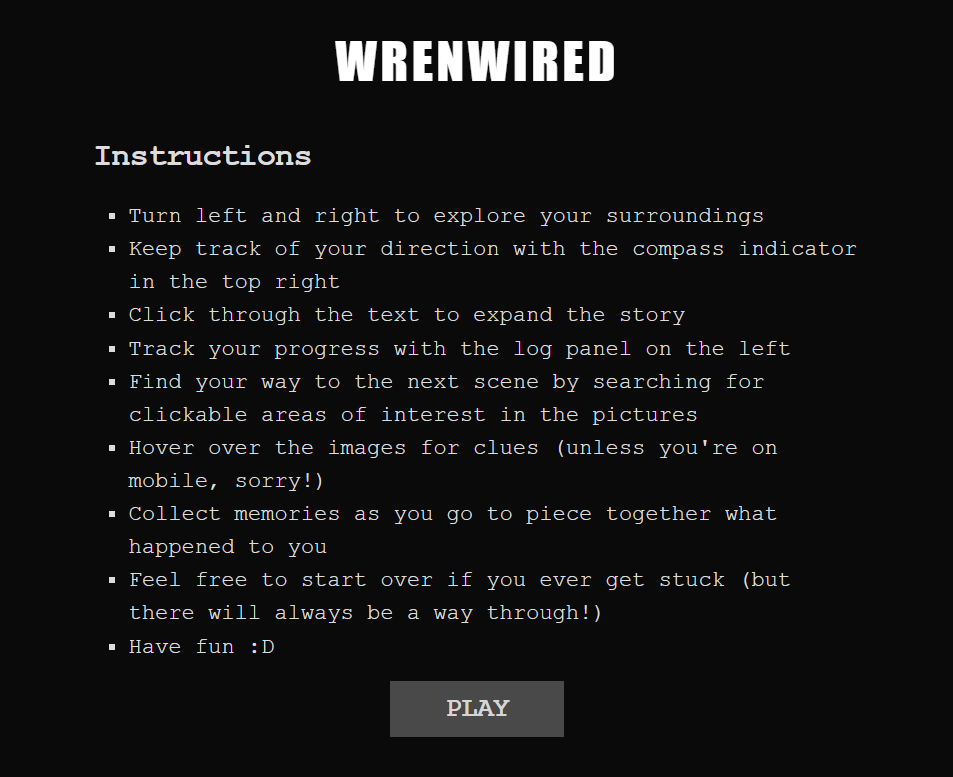

When a user loads up the webpage, they are met with a modal containing instructions on how to play the game. When ready, they can click the 'play' button to close the modal and enter the game.

### Story Frame

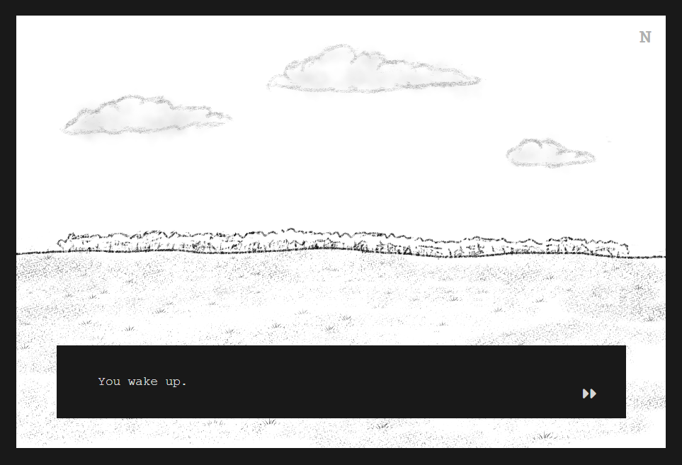

The main feature of the game is a frame containing pictures which can be changed using various buttons. A compass indictor in the top right informs users which direction they are currently facing.

Some of the pictures contain clickable areas which can be used to progress to a new location. For instance, on the first page, the user can click on a line of trees in the distance, and this moves their character to the edge of the forest.

The title attribute is used on the images and clickable areas to add description to the image and provide clues to the way forward when these elements are hovered over with a mouse.

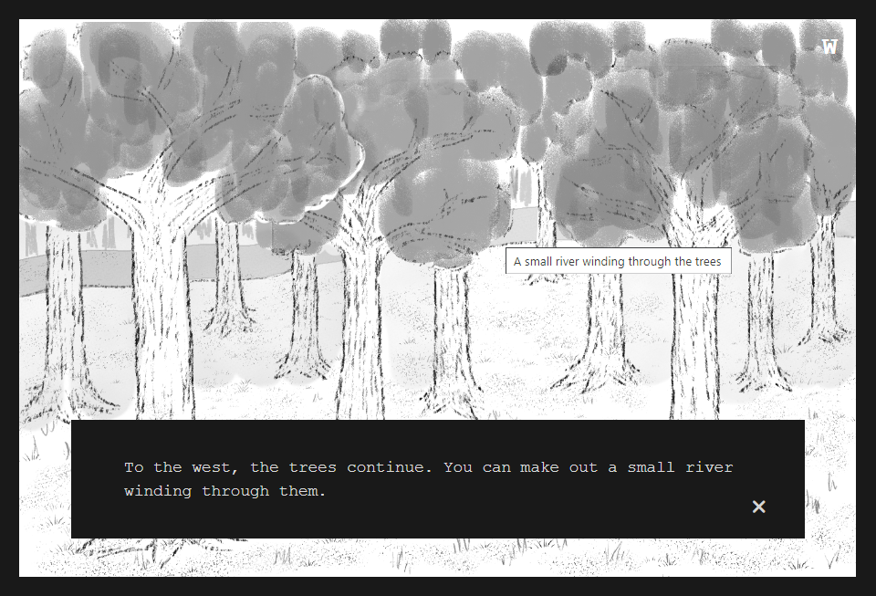

On the second scene of the game, there are two different possible ways to progress, one to the east and one to the west, leading to a branching story that changes depending on the user's decisions. Unforunately, the story at this stage is not complete, however both paths do have a route through to the 'Thank you for playing' page that signals the end of the game.

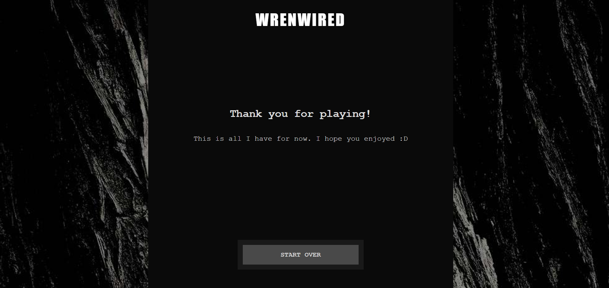

### Textbox

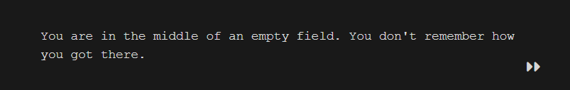

Within the story frame is a textbox which takes the user through the story, using arrow buttons to continue to the next line of text, and a close button to close the box when the text is finished.

### Name Input Modal

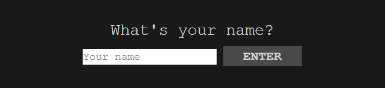

On the first page, the turn buttons and clickable area are disabled until the user progresses through the text, as this opens a modal allowing them to input a name. In order to ensure only valid names are submitted, I used a regular expression to check whether the input contains only letters - if any other characters such as numbers or special characters are present, the name will be rejected, and users will receive a custom JS validity error message informing them why.

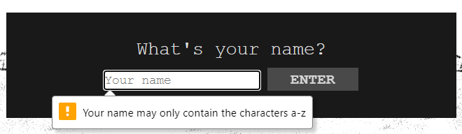

Once a valid name has been inputted, this name is then stored and used in other places throughout the game.

### Log

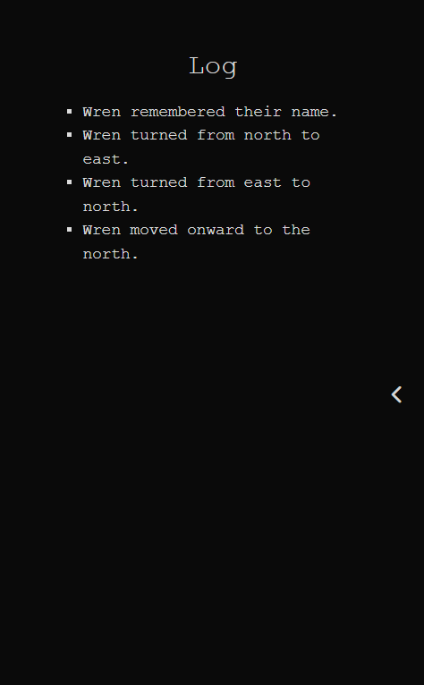

A collapsible log panel on the left hand side tracks user's actions and progress through the story. Once a name has been inputted, the log uses that name for its entries, such as when users turn their character or move to a new location. This allows for a personalised game experience and added interactivity for the user.

The log data is stored in the session storage and then redownloaded and updated when loading a new page, so the log entries for each playthrough persist throughout the game. This information is only cleared when the user closes the browser tab (ending the session), presses the 'start over' button, or otherwise returns to the first page of the game.

### Turn Buttons

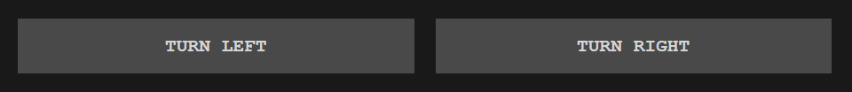

Beneath the story frame are two buttons to turn the character to the left and right. These buttons cycle the story images through the four cardinal directions, with the compass indicator changing to reflect this, as well as adding an entry to the log for each turn. The user should use these to explore all directions and find the image(s) with a hidden button to take them to a new location in order to progress through the game.

On the second page, turning to the left and right also changes in the text in the textbox.

The button text is greyed out when the buttons are disabled to reflect this to the user.

### Start Over Button

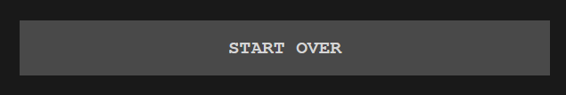

Beneath the turn buttons, there is a start over button, which reloads the website, clears the session storage, and takes the user back to the start of the game.

### Improvements and Features to Add

- Unfortunately, due to time constraints on this project, the game is a lot shorter than I wanted it to be. I originally planned to have a much longer, more branching story, but in the end I had to reduce the scope of the game in order to focus on features and functionality.
- I had originally thought of putting a soundtrack behind the game, but this is a feature I sadly didn't have time to add.
- Another idea I had was to have a way to pick up items that could then be used later, such as picking up a key to open a locked door, but this was another feature I didn't get to add in the end.

---

## Technologies

### Languages

- JavaScript
- HTML5
- CSS3

### Frameworks, Libraries, External Stylesheets etc

- [Git](https://git-scm.com/) for version control
- [GitHub](https://github.com/) to store the project repository and back up git commits
- [Bootstrap v5.3](https://getbootstrap.com/docs/5.3/getting-started/introduction/) to assist in building the structure of the webpage, using the grid system to create a responsive layout
- [Font Awesome](https://fontawesome.com/) for the textbox and log button icons
- [Justinmind](https://www.justinmind.com/) to create the wireframe
- [Clip Studio Paint](https://www.clipstudio.net/en/) to create the story images

---

## Testing

My project was thoroughly tested throughout the development process by both myself and other users. I opted mostly for manual testing over automated testing using Jest, as while automated testing is a very useful tool for testing small parts of code, it is not as good for end to end testing and ensuring the entire application works well together. Given the nature of this project being very user-focused, it felt more relevant to test mostly by getting real-life users to test the whole project.

### User Experience

- All buttons have been thoroughly tested to ensure they work and perform as intended and take the user to the correct location if applicable.
- Testing found that the arrow buttons on the textboxes moved depending on the height of the textbox, which was annoying for users as they had to move their mouse every time to click them, so I adjusted the CSS so that the buttons would stay in a fixed position.
- If a user refreshed the game on the first page or manually returned to page 1 without closing their browser tab, they could re-input a name without the session storage being cleared, which caused a bug in the log entries. To avoid this, I added the `clearSessionStorage()` method on the first page before the `updateLogOnPage()` method, meaning the log would always be cleared before the user could input a new name.
- There was also an issue with name input initially, as my regular expression had only allowed the characters a-z and A-Z, but not spaces, so if a user tried to input a first name and last name with a space between, or left a trailing space before or after their name, it would be rejected. To fix this issue I altered the regex to allow spaces as well as letters.

### Responsiveness

- The project was tested on a variety of device sizes and screen resolutions, by using Chrome Dev Tools during development as well as testing the deployed site on a variety of devices, to ensure that it works responsively.
- Bootstrap's grid system was used to ensure the site elements resize depending on the screen size.
- Some aspects of game don't work as well on mobile, for the instance the text comes out a bit too big and takes up too much of the image, but I felt reducing the font-size further would have led the text to be too hard to read. This is minimised by the textboxes being closeable, so once users are finished reading they can close them to see the full image.
- Also, on computer, the title attribute is used to show clues when the images are hovered over with a mouse. Hovering also helps users locate the hidden buttons, as the mouse cursor changes to a hand to indicate something is clickable. Unfortunately, this is not really possible to replicate on mobile, so it might be harder for mobile users to figure out how to progress.

### Compatibility

- The game was tested on Google Chrome, Mozilla Firefox, Microsoft Edge and Safari to ensure that the website worked well on all browsers. No notable issues were found on any of these.

### Validation

All HTML pages passed through the [W3C validator](https://validator.w3.org/) with no issues. Each page was checked by direct input as well as by running the whole site through the validator via its URI.

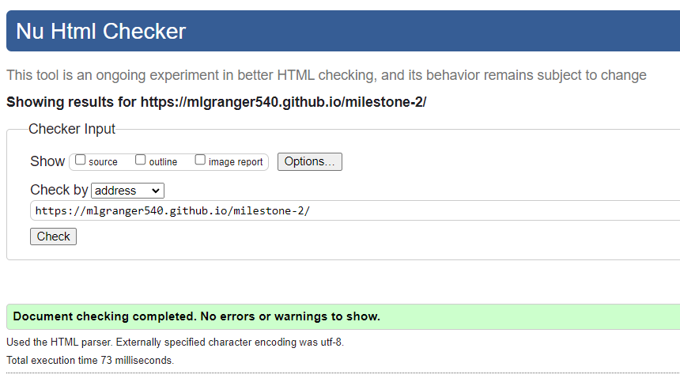

CSS passed through the [Jigsaw validator](https://jigsaw.w3.org/css-validator/) with no issues. CSS was checked by direct input as well as via the site URI.

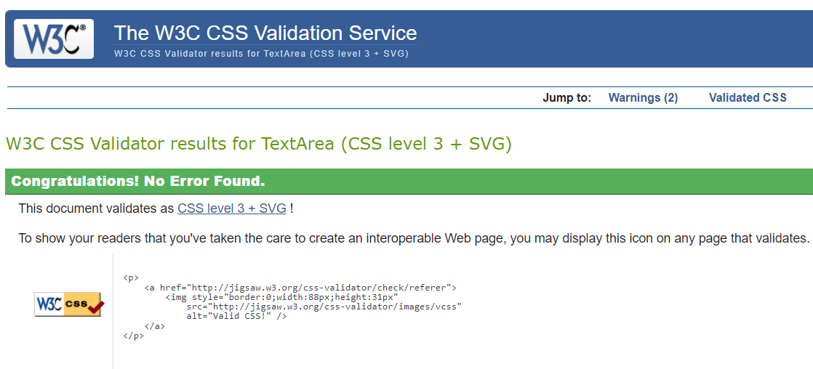

All JavaScript code was passed through [JS Lint](https://www.jslint.com/) and returned no errors, except noting that I had an unused event in a few places. There were some missing semi-colons which I have rectified.

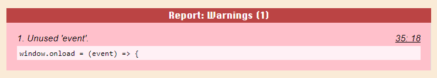

### Accessibility

[WAVE](https://wave.webaim.org/) was used to assess the accessbility of the website.

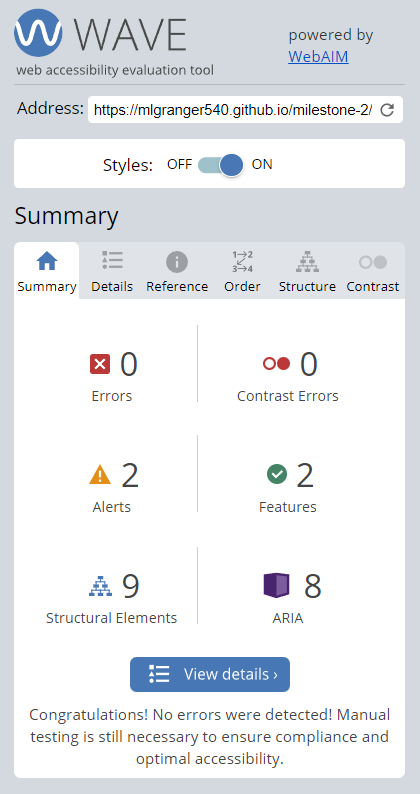

It noted that I had buttons with no text to indicate their function to a screen reader user, so I added aria labels to make this clearer. It also pointed out that the input element had no associated label, so I added a aria label to this as well. It also found a contrast error with the footer, so I altered the colour of the text to make it clearer.

### Known Bugs

There are no currently known bugs with my project.

---

## Deployment

This project was deployed to GitHub Pages. To do this, I followed these steps:

1. Log in to GitHub and navigate to the project repository
2. Go to the settings tab within the repository
3. Click on the 'Pages' subsection
4. Under 'Build and Deployment', make sure the 'Source' dropdown is set to 'Deploy from a branch'
5. Select the 'Branch' dropdown and choose the option 'Main'
6. Make sure the folder is set to '/ (root)'
7. Click 'Save'
8. The live site will then be built and deployed to GitHub pages using the project repository code
8. Once deployed, the link to the live site will appear at the top of the 'Pages' section of settings and will be in the form https://*github-username*.github.io/*repository-name*/

The repository can be forked to create a copy of the repo in the user's GitHub account. Changes made to the forked repository will not affect the original repo. This can be done by clicking the 'Fork' button at the top of the repository page.

The repository can also be cloned to be create a local copy of the repo. This can be done by using the link https://github.com/mlgranger540/milestone-1.git with the `git clone` command to clone using HTTPS. Alternatively GitHub desktop can be used by clicking the 'Code' dropdown on the repository page and selecting 'Open with GitHub Desktop', then following the instructions to create the clone on your local machine.

---

## Credits

### Code

- I learnt about using the title attribute to show text when hovering over elements from [this](https://webmasters.stackexchange.com/questions/120387/how-do-i-show-alt-text-when-hovering-over-an-anchor-with-a-mouse) post
- I used guidance from [W3 Schools](https://www.w3schools.com/howto/howto_css_modals.asp) to build my modals
- I also referred to [W3 Schools](https://www.w3schools.com/howto/howto_css_hide_scrollbars.asp) for information on how to hide the scrollbar on the log side panel
- I referred to the docs on session storage [here](https://developer.mozilla.org/en-US/docs/Web/API/Window/sessionStorage) in order to store the log across the game pages
- I also used the docs on regular expressions [here](https://developer.mozilla.org/en-US/docs/Web/JavaScript/Guide/Regular_Expressions) to build my regex in order to ensure inputted names only contained valid characters

### Content

- All text and story content was written by me

### Media

- All story images were created by me
- Background image was found on [Pexels](https://www.pexels.com/photo/bark-black-and-white-hardwood-oak-355757/)
- [Font Awesome](https://fontawesome.com/) for the icons

### Acknowledgements

- My family and friends for testing the deployed project and providing feedback as well as detailing any bugs found (special mention once again to Ben!)
